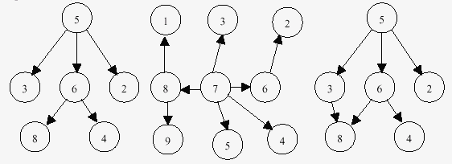

# Fa (Tree)

A jól ismert adatstruktúra, amely lehet üres vagy halmaza egy vagy több pontnak, amelyek élekkel kapcsolódnak egymáshoz, kielégítve az alábbi feltételeket.

* Pontosan egy - gyökérnek nevezett - pont van, amelybe nem érkezik él.
* A gyökeret kivéve, minden csúcsba pontosan egy él mutat.
* A gyökérből minden csúcsba pontosan egy irányított élsorozaton át lehet eljutni.

Például tekintsük az alábbi illusztrációt, amelyen a csúcsokat körök, az éleket pedig nyilak helyettesítik. Az első kettő fa, a harmadik nem az.

## Feladat:

Írj programot, amely a csúcsok és a köztük lévő irányított élek ismeretében megadja, hogy a struktúra definíció szerint fa vagy sem.

### Bemenet:

A bemeneti állomány N tesztesetet tartalmaz. Az első sorban az N értéke szerepel. Minden teszteset első sorában egy K pozitív egész áll. A következő sorban K darab számpár található, amelyek mindegyike egy-egy irányított élet reprezentál. A számpár első tagja azt a csúcsot adja meg, amelyből az él indul, a másik szám pedig azt, amelybe mutat. A csúcsok száma minden esetben nullánál nagyobb.

### Kimenet:

Minden tesztesetre a "_k_ fa" vagy a "_k_ nem fa" üzenetek közül a megfelelőt kell írni a kimeneti állományba, ahol _k_ a teszteset sorszámát jelenti.

### Példa:

| **Input.txt**                     | **output** |
|-----------------------------------|------------|
| 3                                 |            | 
| 5                                 |            |
| 6 8 5 3 5 2 6 4 5 6               | 1 fa       |
| 8 1 7 3 6 2 8 9 7 5 7 4 7 8 7 6   | 2 fa       |
| 3 8 6 8 6 4 5 3 5 6 5 2           | 3 nem fa   |   

_(ACM ELTE csapatverseny 2000)_

*   [i2\_1](i2_1)
*   [i2\_2](i2_2)
*   [i2\_3](i2_3)

[Eredeti](https://people.inf.elte.hu/veanna/nevalgimplementalas/02/fa.htm)

---

## Megoldás

A feladatban egy gráfot az éleivel adnak meg. A csúcsokat egész számok írják le. Már az első példában is (`6 8 5 3 5 2 6 4 5 6`)
szembetűnik, hogy egy tömbös ábrázolás itt nem megfelelő: nem minden szám szerepel a gráfban
`0`-tól `'maximum'`-ig, csak néhány. A legjobb választás egy [`Map`](https://docs.oracle.com/en/java/javase/24/docs/api/java.base/java/util/Map.html). 
A tárgyat eredetileg C++ programozási nyelven történő megoldásokhoz találták ki, amiben akkoriban nem volt standard az 
[`unordered_map`](https://en.cppreference.com/w/cpp/container/unordered_map.html) (ami a Java-s [`HashMap`](https://docs.oracle.com/en/java/javase/24/docs/api/java.base/java/util/HashMap.html) megfelelője) 
így minden `lookup` művelet minimum `O(log(n))`-es volt. Ami az egész végrehajtásra tett egy ekkora minimumot. (Legjobb megoldás: `O(V*log(V)))`.)
Mindez `HashMap` segítségével `O(1)`-es költség, így a körfelderítés `O(V)` (egyenesen arányos a csúcsok számával).

Mivel a feladat nem irányított köröket keres (irányított gráfban), ezért egy szélességi bejárás tökéletesen alkalmas a 
megoldásra. 3 dolgot kell vizsgálnunk:
1. Pontosan 1 gyökér elem van-e? 
    * Mivel az összes csúcs, amiből indul él szerepel a `Map`-ünk `key` halmazában,
        így elég csak azt viszgálni, mely elemek nem szerepelnek ebből a `value` oldalon.
        a fennmaradó értékek a gráf gyökérelemei.
2. Összefüggő-e? Pontosabban: minden csúcs elérhető-e a gyökérelemből? (mivel a `A->B<-C` is összefüggő, de nem minden csúcs érhető el a gyökérelem(ek)ből.)
   * Erre ismétetlen tökéletes egy szélességi bejárás. 
3. Nincs benne irányítatlan kör

Csak hogy még egy fajta bejárás szerepeljen a megoldásban, implementáltam azt is, irányított kör van-e a gráfban.

[A kód](../app/src/main/java/io/github/zebalu/nai/feladat02/Tree.java)

